# spec2cloud

**Spec2Cloud** is an AI-powered development workflow that transforms high-level product ideas into production-ready applications deployed on Azure—using specialized GitHub Copilot agents working together.

https://github.com/user-attachments/assets/f0529e70-f437-4a14-93bc-4ab5a0450540

## 🎯 Overview

This repository provides a preconfigured development environment and agent-driven workflow that works in two directions:

- **Greenfield (Build New)**: Transform product ideas into deployed applications through structured specification-driven development
- **Brownfield (Document Existing)**: Reverse engineer existing codebases into comprehensive product and technical documentation

Both workflows use specialized GitHub Copilot agents working together to maintain consistency, traceability, and best practices.

## 🚀 Quick Start

### Greenfield (New Project)
1. **Open in Dev Container** - Everything is preconfigured in `.devcontainer/`
2. **Describe your app idea** - The more specific, the better
3. **Follow the workflow** - Use the prompts to guide specialized agents through each phase

### Brownfield (Existing Codebase)
1. **Open existing codebase** in Dev Container
2. **Run `/plan-brown`** - Reverse engineer technical tasks from code
3. **Run `/frd-brown`** - Synthesize feature requirements from tasks
4. **Run `/prd-brown`** - Create product vision from features

## 🏗️ Architecture

### Development Environment

The `.devcontainer/` folder provides a **ready-to-use development container** with:
- Python 3.12


- Azure CLI & Azure Developer CLI (azd)
- TypeScript
- Docker-in-Docker
- VS Code extensions: GitHub Copilot Chat, Azure Pack, AI Studio

### MCP Servers

The `.vscode/mcp.json` configures **Model Context Protocol servers** that give agents access to:
- **context7** - Up-to-date library documentation
- **github** - Repository management and operations
- **microsoft.docs.mcp** - Official Microsoft/Azure documentation
- **playwright** - Browser automation capabilities
- **deepwiki** - Repository context and understanding for external repos

### AI Agents (Chat Modes)

Four specialized agents in `.github/chatmodes/`:

#### 1. **PM Agent** (`@pm`) - Product Manager
- **Model**: o3-mini
- **Tools**: Edit files, search, fetch web content
- **Purpose**: Translates ideas into structured PRDs and FRDs
- **Instructions**: Asks clarifying questions, identifies business goals, creates living documentation

#### 2. **Dev Lead Agent** (`@dev-lead`) - Technical Lead
- **Model**: Claude Sonnet 4
- **Tools**: Read files, search, semantic analysis
- **Purpose**: Reads all standards from `standards/` and generates comprehensive `AGENTS.md`
- **Instructions**: Analyzes engineering standards, creates unified agent guidelines, establishes coding patterns
- **Usage**: Run `/generate-agents` at project start (can defer until before `/plan` and `/implement`)

#### 3. **Dev Agent** (`@dev`) - Developer
- **Model**: Claude Sonnet 4
- **Tools**: Full development suite + Context7, GitHub, Microsoft Docs, Copilot Coding Agent, AI Toolkit
- **Purpose**: Breaks down features into tasks, implements code, or delegates to GitHub Copilot
- **Instructions**: Analyzes specs, writes modular code, follows architectural patterns, creates GitHub issues

#### 4. **Azure Agent** (`@azure`) - Cloud Architect
- **Model**: Claude Sonnet 4
- **Tools**: Azure resource management, Bicep, deployment tools, infrastructure best practices
- **Purpose**: Deploys applications to Azure with IaC and CI/CD pipelines
- **Instructions**: Analyzes codebase, generates Bicep templates, creates GitHub Actions, uses Azure Dev CLI

## 📋 Workflows

### Greenfield Workflow (Forward: Idea → Code)

```mermaid
graph TB
    Start[("👤 User<br/>High-level app description")]
    
    Start --> PRD["<b>/prd</b><br/>📝 PM Agent creates<br/>Product Requirements Document"]
    
    PRD --> FRD["<b>/frd</b><br/>📋 PM Agent breaks down<br/>Feature Requirements Documents"]
    
    FRD --> GenAgents["<b>/generate-agents</b><br/>🎯 Dev Lead reads standards<br/>& generates AGENTS.md<br/>(optional, before /plan)"]
    
    GenAgents --> Plan["<b>/plan</b><br/>🔧 Dev Agent creates<br/>Technical Task Breakdown"]
    
    Plan --> Choice{"Implementation<br/>Choice"}
    
    Choice -->|Local| Implement["<b>/implement</b><br/>💻 Dev Agent<br/>implements code locally"]
    
    Choice -->|Delegated| Delegate["<b>/delegate</b><br/>🎯 Dev Agent creates<br/>GitHub Issue + assigns<br/>Copilot Coding Agent"]
    
    Implement --> Deploy["<b>/deploy</b><br/>☁️ Azure Agent<br/>creates IaC + deploys to Azure"]
    
    Delegate --> Deploy
    
    Deploy --> Done[("✅ Production-Ready<br/>Application on Azure")]
    
    style Start fill:#e1f5ff
    style PRD fill:#fff4e6
    style FRD fill:#fff4e6
    style GenAgents fill:#e3f2fd
    style Plan fill:#e8f5e9
    style Implement fill:#e8f5e9
    style Delegate fill:#e8f5e9
    style Deploy fill:#f3e5f5
    style Done fill:#e1f5ff
    style Choice fill:#fff9c4
```



### Brownfield Workflow (Reverse: Code → Documentation)

```mermaid
graph TB
    StartBrown[("📦 Existing Codebase<br/>Undocumented or<br/>poorly documented")]
    
    StartBrown --> PlanBrown["<b>/plan-brown</b><br/>💻 Dev Agent analyzes code<br/>& documents technical tasks"]
    
    PlanBrown --> FRDBrown["<b>/frd-brown</b><br/>📋 PM Agent synthesizes<br/>Feature Requirements from tasks"]
    
    FRDBrown --> PRDBrown["<b>/prd-brown</b><br/>📝 PM Agent creates<br/>Product Vision from features"]
    
    PRDBrown --> DocDone[("✅ Comprehensive Documentation<br/>PRD + FRDs + Tasks<br/>with full traceability")]
    
    DocDone -.->|Optional| Enhance["<b>Continue with greenfield</b><br/>🔄 Use /frd, /plan to add<br/>new features or improvements"]
    
    style StartBrown fill:#ffe0b2
    style PlanBrown fill:#e8f5e9
    style FRDBrown fill:#fff4e6
    style PRDBrown fill:#fff4e6
    style DocDone fill:#e1f5ff
    style Enhance fill:#f3e5f5
```



### Greenfield Workflow Steps (Forward)

1. **`/prd`** - Product Requirements Document
   - PM Agent engages in conversation to understand the product vision
   - Creates `specs/prd.md` with goals, scope, requirements, and user stories
   - Living document that evolves with feedback

2. **`/frd`** - Feature Requirements Documents
   - PM Agent decomposes the PRD into individual features
   - Creates files in `specs/features/` for each feature
   - Defines inputs, outputs, dependencies, and acceptance criteria

3. **`/generate-agents`** - Generate Agent Guidelines (Optional)
   - Dev Lead Agent reads all standards from `standards/` directory
   - Consolidates engineering standards into comprehensive `AGENTS.md`
   - Can be run at project start or deferred until before `/plan` and `/implement`
   - **Must be completed before planning and implementation begins**

4. **`/plan`** - Technical Planning
   - Dev Agent analyzes FRDs and creates technical task breakdowns
   - Creates files in `specs/tasks/` with implementation details
   - Identifies dependencies, estimates complexity, defines scaffolding needs

5. **`/implement`** OR **`/delegate`** - Implementation
   - **Option A (`/implement`)**: Dev Agent writes code directly in `src/backend` and `src/frontend`
   - **Option B (`/delegate`)**: Dev Agent creates GitHub Issues with full task descriptions and assigns to GitHub Copilot Coding Agent
   
6. **`/deploy`** - Azure Deployment
   - Azure Agent analyzes the codebase
   - Generates Bicep IaC templates
   - Creates GitHub Actions workflows for CI/CD
   - Deploys to Azure using Azure Dev CLI and MCP tools

### Brownfield Workflow Steps (Reverse)

1. **`/plan-brown`** - Reverse Engineer Technical Tasks
   - Dev Agent analyzes existing codebase (any language/framework)
   - Documents implementation as discrete technical tasks
   - Creates files in `specs/tasks/` with evidence-based specifications
   - **Critical Rules**:
     - ⚠️ **NEVER modifies code** - Read-only analysis
     - ⚠️ **Documents ONLY what exists** - No fabrication
     - ⚠️ **Honest about gaps** - Notes missing tests, incomplete features
     - Links each task to actual code files and implementations

2. **`/frd-brown`** - Synthesize Feature Requirements
   - PM Agent reads all tasks from `specs/tasks/`
   - Groups related tasks into logical product features
   - Creates files in `specs/features/` focused on WHAT, not HOW
   - **Critical Rules**:
     - ⚠️ **Product perspective** - User capabilities, not technical details
     - ⚠️ **Evidence-based** - User stories from actual functionality
     - ⚠️ **Task traceability** - Links features back to implementing tasks
     - ⚠️ **Honest about status** - Notes complete/partial/unclear features

3. **`/prd-brown`** - Create Product Vision
   - PM Agent reads all FRDs from `specs/features/`
   - Synthesizes overarching product purpose and strategy
   - Creates `specs/prd.md` with goals, scope, requirements
   - **Critical Rules**:
     - ⚠️ **Strategic synthesis** - Product vision from feature collection
     - ⚠️ **Honest about clarity** - Notes when vision is unclear/inferred
     - ⚠️ **Feature traceability** - Maps requirements to implementing FRDs
     - ⚠️ **Documents assumptions** - Explicit about what requires validation
     - Provides product status assessment and recommendations

### Why Use Brownfield Workflow?

- **Onboard new team members** - Comprehensive documentation of existing systems
- **Legacy system understanding** - Reverse engineer undocumented codebases
- **Pre-acquisition due diligence** - Document technical assets before purchase
- **Migration planning** - Understand current state before modernization
- **Audit and compliance** - Document what the system actually does
- **Knowledge preservation** - Capture tribal knowledge before team changes
- **Bridge to modernization** - After documenting, use greenfield workflow to add features

## 📁 Documentation Structure

The workflow creates living documentation:

```
specs/
├── prd.md              # Product Requirements Document
├── features/           # Feature Requirements Documents
│   ├── feature-1.md
│   └── feature-2.md
└── tasks/              # Technical Task Specifications
    ├── task-1.md
    └── task-2.md

src/
├── backend/            # Backend implementation
└── frontend/           # Frontend implementation

standards/
├── general/            # General engineering standards
├── backend/            # Backend-specific standards
└── frontend/           # Frontend-specific standards

AGENTS.md               # Consolidated agent guidelines (generated)
mkdocs.yml              # MKdocs configuration for documentation site
docs/                   # MKdocs documentation source files
```

### Documentation with MKdocs

This repository is configured with **MKdocs** for generating beautiful project documentation:

- **Configuration**: `mkdocs.yml` contains site settings and navigation
- **Source Files**: Documentation markdown files in `docs/` directory
- **Standards**: Documentation practices defined in `standards/general/documentation-guidelines.md`
- **Build & Serve**: Use MKdocs commands to preview and deploy documentation

The documentation standards ensure consistency, accessibility, and maintainability across all project documentation.

## 🔧 Managing Standards with Git Subtrees

This repository uses **git subtrees** to integrate engineering standards from external repositories. The `standards/` folder contains subtrees from three separate guideline repositories.

### Technology-Specific Standards via Branches

Each standards repository uses **branches** to organize technology-specific rules:

- **Backend Standards**: Choose between `dotnet` or `python` branches
- **Frontend Standards**: Choose between `react`, `angular`, or other framework branches
- **General Standards**: Use `main` branch for universal guidelines

This approach allows you to pull only the standards relevant to your tech stack.

### Adding Subtrees (Initial Setup)

When setting up the repository, specify the appropriate branch for your tech stack:

```bash
# General standards (always use main)
git subtree add --prefix standards/general https://github.com/EmeaAppGbb/spec2cloud-guidelines.git main --squash

# Backend standards - choose your stack
git subtree add --prefix standards/backend https://github.com/EmeaAppGbb/spec2cloud-guidelines-backend.git dotnet --squash
# OR
git subtree add --prefix standards/backend https://github.com/EmeaAppGbb/spec2cloud-guidelines-backend.git python --squash

# Frontend standards - choose your framework
git subtree add --prefix standards/frontend https://github.com/EmeaAppGbb/spec2cloud-guidelines-frontend.git react --squash
# OR
git subtree add --prefix standards/frontend https://github.com/EmeaAppGbb/spec2cloud-guidelines-frontend.git angular --squash
```

### Updating Subtrees

To pull the latest changes from the upstream guideline repositories, use the same branch:

```bash
# Update general standards
git subtree pull --prefix standards/general https://github.com/EmeaAppGbb/spec2cloud-guidelines.git main --squash

# Update backend standards (use your chosen branch)
git subtree pull --prefix standards/backend https://github.com/EmeaAppGbb/spec2cloud-guidelines-backend.git dotnet --squash

# Update frontend standards (use your chosen branch)
git subtree pull --prefix standards/frontend https://github.com/EmeaAppGbb/spec2cloud-guidelines-frontend.git react --squash
```

> **Note**: The `--squash` flag combines all commits from the subtree repository into a single commit, keeping the history clean.

### Switching Technology Stacks

If you need to switch to a different tech stack (e.g., from React to Angular), remove the old subtree and add the new one:

```bash
# Remove old subtree
git rm -r standards/frontend
git commit -m "Remove React standards"

# Add new subtree
git subtree add --prefix standards/frontend https://github.com/EmeaAppGbb/spec2cloud-guidelines-frontend.git angular --squash
```

## 🎓 Example Usage

### Greenfield Example (New Project)

```bash
# Start with your product idea
"I want to create a smart AI agent for elderly care that tracks vitals and alerts caregivers"

# Step 1: Create the PRD
/prd

# Step 2: Break down into features
/frd

# Step 3: Generate agent guidelines from standards (optional, can defer)
/generate-agents

# Step 4: Create technical plans
/plan

# Step 5a: Implement locally
/implement

# OR Step 5b: Delegate to GitHub Copilot
/delegate

# Step 6: Deploy to Azure
/deploy
```

### Brownfield Example (Existing Project)

```bash
# You have an existing codebase with minimal or outdated documentation
"I inherited a marketing campaign management app built in Python/React"

# Step 1: Reverse engineer technical tasks from code
/plan-brown
# Agent analyzes codebase (Python FastAPI backend, React frontend)
# Creates specs/tasks/ with honest documentation of what exists
# Notes: "Task 008: Email service - stub only, not fully implemented"

# Step 2: Synthesize feature requirements from tasks
/frd-brown
# Agent groups tasks into product features
# Creates specs/features/campaign-management.md, user-authentication.md, etc.
# Notes: "Email notifications feature - partially implemented"

# Step 3: Create product vision from features
/prd-brown
# Agent synthesizes overall product purpose
# Creates specs/prd.md with goals, scope, user stories
# Includes "Product Status Assessment" with gaps and recommendations

# Result: Complete documentation traceability
# PRD → FRDs → Tasks → Code (with file paths)

# Optional: Now enhance using greenfield workflow
/frd  # Add new features to existing FRDs
/plan # Create tasks for new features
/implement # Build the enhancements
```

## 🔑 Key Benefits

### Greenfield Benefits
- **Zero Setup** - Dev container has everything preconfigured
- **Structured Process** - Clear workflow from idea to production
- **AI-Powered** - Specialized agents handle different aspects
- **Best Practices** - Built-in architectural guidance via `AGENTS.md`
- **Flexible Implementation** - Choose local development or delegation
- **Azure-Ready** - Automated IaC and CI/CD generation

### Brownfield Benefits
- **Comprehensive Documentation** - Reverse engineer complete product docs from code
- **Full Traceability** - Every product requirement links to code implementation
- **Honest Assessment** - Identifies gaps, missing tests, incomplete features
- **Technology Agnostic** - Works with any language/framework (.NET, Python, Node.js, Java, etc.)
- **Knowledge Capture** - Preserves understanding before team changes
- **Bridge to Modernization** - Document current state, then enhance with greenfield workflow
- **Onboarding Accelerator** - New developers understand system architecture quickly

### Universal Benefits
- **Living Documentation** - Specs evolve with the codebase
- **Bidirectional Workflow** - Start with idea OR start with code
- **Specialized Agents** - PM, Dev, Dev Lead, and Azure agents with distinct roles
- **Evidence-Based** - Brownfield never fabricates, greenfield builds intentionally

## 📖 Learn More

- See `AGENTS.md` for comprehensive engineering guidelines
- Explore `.github/chatmodes/` for agent configurations
- Review `.github/prompts/` for prompt templates

## 🤝 Contributing

Contributions welcome! Extend with additional agents, prompts, or MCP servers.

---

**From idea to production in minutes, not months.** 🚀
